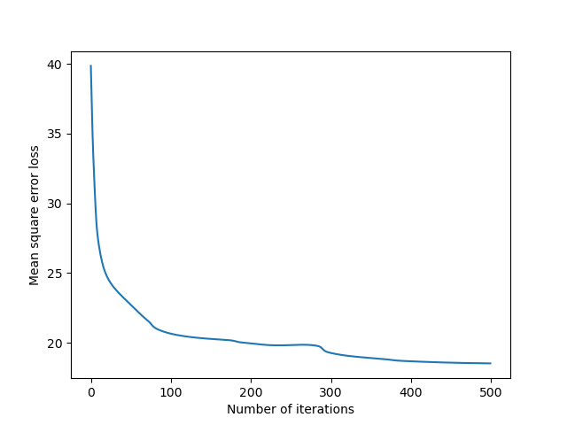

# 2层全连接网络

[TOC]

**题目：**产生随机的样本，实现一个2层全连接网络，激活函数为sigmoid函数，损失函数为均方误差，采用梯度下降法优化，并画出损失值曲线。
## sigmoid函数
$$
y=\frac{1}{1+e^{-z}}
$$
```python
def sigmoid(inX):
    res = 1 / (1 + torch.exp(-inX))
    return res
```
## 损失函数均方误差
$$
L(y|f(x))=\sum_{N}^{}{(y-f(x))}^{2}
$$
特点：经常用于回归问题
```python
Y_loss = torch.sum(torch.pow(y_out - Y, 2)) / 2  # 损失函数：均方误差
```
## 优化函数梯度下降法
梯度下降法公式：$$$W_{j+1}=W_{j}+\bigtriangledown J(W_{j})$$$
```python
    # 更新连接权和阈值
    w += grad_w
    theta += grad_theta
    v += grad_v
    gama += grad_gama
```
## BP算法
误差反向（误差逆）传播算法（Error BackPropagation, 简称BP）是最成功的训练多层前馈神经网络的学习算法。
### 前向计算
**step1：**$$$b_{h}=f(\beta _{h}-\gamma _{h})$$$，$$$\beta_{h} =\sum_{i=1}^{d}\upsilon _{ih}x_{i}$$$
**step2：**$$$\hat{y}_{j}^{k}=f(\alpha _{j}-\theta _{j})$$$，$$$\alpha_{j} =\sum_{h=1}^{q} \omega _{hj}b_{h}$$$
**step3：**$$$E_{k}=\frac{1}{2}\sum_{j=1}^{l}(\hat{y}_{j}^{k}-y_{j}^{k})^{2}$$$
### 参数优化：BP算法（基于梯度下降法）
BP算法基于梯度下降策略, 以目标的负梯度方向对参数进行调整. 对误差$$$E_{k}$$$,给定学习率$$$\eta $$$.
$$
g_{j}=-(\hat{y}_{j}^{k}-y_{j}^{k})\hat{y}_{j}^{k}(1-\hat{y}_{j}^{k})
$$
$$
\Delta \omega _{hj}=\eta g_{j}b_{n}
$$
$$
\Delta \theta _{j}=-\eta g_{j}
$$
$$
e_{h}=b_{n}(1-b_{n})\sum_{j=1}^{l}g_{j}\omega _{hj}
$$
$$
\Delta \upsilon _{ih}=\eta e_{h}x_{i}
$$
$$
\Delta \gamma _{h}=-\eta e_{h}
$$

**输入：**训练集$$$D=\left\{ (x_{k},y_{k})\right\}_{k=1}^{m}$$$，学习率$$$\eta$$$

**过程：**

1. 在(0,1)范围内随机初始化网络中所有连接权和阈值
2. repeat
	for all $$$(x_{k},y_{k})\in D$$$ do
    计算当前样本的输出$$$\hat{y}_{j}^{k}$$$；
    计算输出层神经元的梯度项$$$g_{j}$$$；
    计算隐层神经元的梯度项$$$e_{h}$$$；
	更新连接权$$$\omega _{hj}$$$，$$$\upsilon _{ih}$$$与阈值$$$\theta _{j}$$$,$$$\gamma _{h}$$$
	end for
	until 达到停止条件

**输出：**连接权与阈值确定的多层前向神经网络
```python
def train(X, Y, V, G, W, T, Eta):
    #  前向计算
    b = sigmoid(torch.mm(X, V) + G)
    y_out = sigmoid(torch.mm(b, W) + T)  # 计算当前样本的输出
    Y_loss = torch.sum(torch.pow(y_out - Y, 2)) / 2  # 损失函数：均方误差

    gj = - (y_out - Y) * y_out * (1 - y_out)  # 计算输出层神经元的梯度项
    G_W = Eta * torch.transpose(torch.mm(torch.transpose(gj, 0, 1), b), 0, 1)
    G_T = - torch.sum(Eta * gj, 0)
    e = b * (1 - b) * torch.mm(gj, torch.transpose(W, 0, 1))  # 计算隐层神经元的梯度项
    G_V = Eta * torch.transpose(torch.mm(torch.transpose(e, 0, 1), X), 0, 1)
    G_G = - torch.sum(Eta * e, 0)
    return Y_loss, G_V, G_G, G_W, G_T

# BP学习算法
for t in range(500):
    y_loss, grad_v, grad_gama, grad_w, grad_theta = train(x, y, v, gama, w, theta, eta)
    loss[t] = y_loss

    # 更新连接权和阈值
    w += grad_w
    theta += grad_theta
    v += grad_v
    gama += grad_gama
```

## 完整代码
```python
import torch
from matplotlib import pyplot as plt
import numpy as np


def sigmoid(inX):
    res = 1 / (1 + torch.exp(-inX))
    return res


def train(X, Y, V, G, W, T, Eta):
    #  前向计算
    b = sigmoid(torch.mm(X, V) + G)
    y_out = sigmoid(torch.mm(b, W) + T)  # 计算当前样本的输出
    Y_loss = torch.sum(torch.pow(y_out - Y, 2)) / 2  # 损失函数：均方误差

    gj = - (y_out - Y) * y_out * (1 - y_out)  # 计算输出层神经元的梯度项
    G_W = Eta * torch.transpose(torch.mm(torch.transpose(gj, 0, 1), b), 0, 1)
    G_T = - torch.sum(Eta * gj, 0)
    e = b * (1 - b) * torch.mm(gj, torch.transpose(W, 0, 1))  # 计算隐层神经元的梯度项
    G_V = Eta * torch.transpose(torch.mm(torch.transpose(e, 0, 1), X), 0, 1)
    G_G = - torch.sum(Eta * e, 0)
    return Y_loss, G_V, G_G, G_W, G_T


# 步长
eta = 0.1
# 每次迭代后计算损失函数值，以备画图使用
loss = np.zeros(500)

m, d, q, l = 32, 20, 10, 2  # m样本数；d输入维度（属性数）；q隐层神经元维度；l输出神经元维度

# 输入数据和输出数据
x = torch.randn(m, d)
y = torch.randn(m, l)

# 两层权重，以及初始化
v = torch.randn(d, q)  # 第一层
gama = torch.randn(q)
w = torch.randn(q, l)  # 第二层
theta = torch.randn(l)

# BP学习算法
for t in range(500):
    y_loss, grad_v, grad_gama, grad_w, grad_theta = train(x, y, v, gama, w, theta, eta)
    loss[t] = y_loss

    # 更新连接权和阈值
    w += grad_w
    theta += grad_theta
    v += grad_v
    gama += grad_gama

plt.figure()
plt.plot(loss)
plt.xlabel('Number of iterations')
plt.ylabel('Mean square error loss')
plt.show()
```
## 损失值曲线
